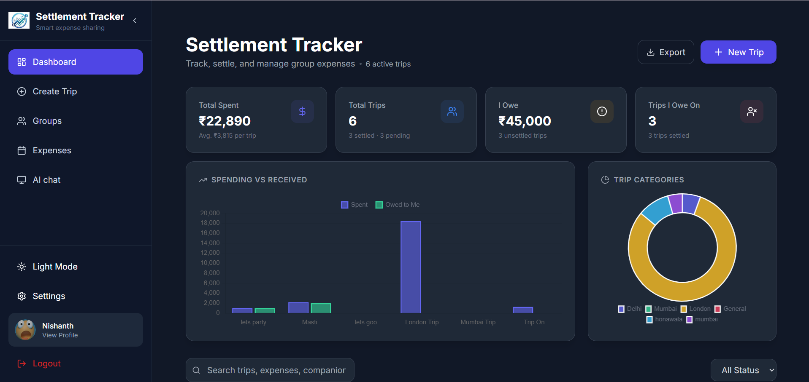
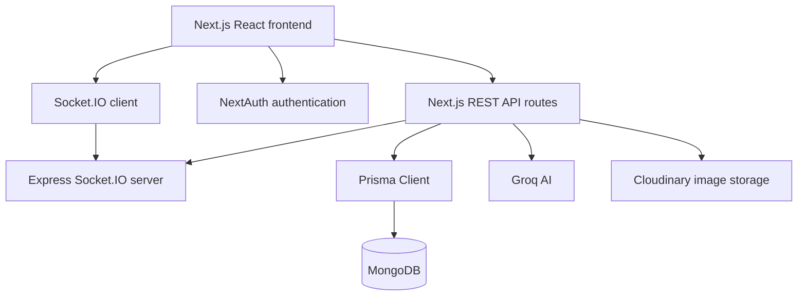

# Settlement Tracker

A full-stack group expense management and settlement platform for managing trips, shared expenses, balances, settlements, real-time communication, budgets, and AI-powered spending insights.

## Screenshots

Screenshots are planned for the following application areas:




The screenshot files are placeholders and are not included in the repository yet.

## Features

- **Trip and group management:** Create trips, edit trip details, manage destinations, dates, descriptions, images, and budgets.
- **Invite codes:** Invite members through shareable trip invite links.
- **Member management:** Add, join, remove, and leave group memberships with admin controls.
- **Expense tracking:** Create, view, and delete shared expenses.
- **Expense categories and splits:** Categorize expenses and assign explicit member shares.
- **Settlement calculation:** Calculate who owes money and who is owed from persisted expenses and splits.
- **Demo payment flow:** Request payment, pay an automatically calculated outstanding amount, persist completed settlements, and show payment messages in group chat.
- **Real-time group chat:** Send text and image messages in trip-specific conversations.
- **Socket.IO:** Broadcast new, edited, deleted, payment, and budget messages to connected trip rooms.
- **Typing indicators:** Show active typing state in group conversations.
- **Message editing and deletion:** Edit and delete eligible user messages.
- **Budget tracking:** Compare trip spending against the stored trip budget.
- **Budget threshold notifications:** Persist and broadcast alerts at 25%, 50%, 75%, and 100% of a trip budget.
- **Overspending notifications:** Persist and broadcast an alert when spending exceeds the trip budget.
- **AI spending assistant:** Ask questions about authorized trip expenses, budgets, categories, balances, and settlements through the existing Groq integration.
- **Dashboard statistics:** View spending, outstanding balances, trip status, charts, and trip summaries.
- **Authentication:** Sign in with email/password credentials, Google, or GitHub through NextAuth.
- **Profile management:** Update profile name and image, with Cloudinary support for image uploads.
- **Settings:** Manage profile data, theme controls, and persisted budget and payment notification preferences.

## AI Spending Assistant

The AI assistant uses authenticated trip data from the application database. Its context includes trip budgets, total spending, remaining budget, spending percentage, expenses, categories, members, calculated balances, and settlement records for trips the user belongs to.

Supported questions include:

- How much have we spent?
- How much budget is remaining?
- How much have I personally spent?
- Who owes me money?
- Who do I owe?
- Which category has the highest spending?
- What was our biggest expense?
- How much did we spend on food?
- Are we over budget?
- What payments have been completed?
- Which expenses or settlements are still pending?

The assistant is instructed to use the supplied structured data and avoid inventing unavailable figures. Responses are generated through the existing Groq API integration.

## Budget Tracking

Each trip stores a numeric budget in MongoDB. Expense totals, remaining budget, and percentage used are calculated from the trip's persisted expenses.

When expense creation crosses a threshold, the application creates an idempotent system message in the relevant group chat and broadcasts it through the existing Socket.IO service:

- 25% of budget used
- 50% of budget used
- 75% of budget used
- 100% of budget used
- Spending above the budget

Each threshold is recorded once per trip, so subsequent expenses do not repeatedly create the same alert.

## Settlement and Demo Payments

Settlement balances are calculated from expense payment and split data. A member can request payment, which remains pending until the payer completes the demo payment flow.

For a payment, the server determines the authoritative outstanding amount. The user cannot edit the amount in the payment modal. A completed payment is stored as a `Settlement` record, and a corresponding payment message is persisted in the trip chat and broadcast to connected members.

> **Demo payment disclaimer:** No real money is transferred. Payments are simulated for demonstration purposes and do not use a real UPI provider or payment gateway.

## Real-Time Architecture

The application uses one Socket.IO connection per active group conversation. The Next.js API persists messages first, then sends them to the standalone Socket.IO server's broadcast routes with the correct `tripId`.

Current real-time behavior includes:

- Trip-room message broadcasts
- Payment and budget alert broadcasts
- Message edit and delete events
- Typing indicators
- Connection status updates
- Duplicate prevention in the client message list

Messages are stored in Prisma before broadcast, so users who were offline can load them from the database after reconnecting or refreshing.

## Tech Stack

### Web application

- Next.js 14
- React 18
- TypeScript
- Tailwind CSS
- shadcn/ui-style components built with Radix UI
- NextAuth
- Prisma Client
- MongoDB
- Chart.js and `react-chartjs-2`
- Groq SDK
- Cloudinary
- Nodemailer
- Axios

### Real-time server

- Node.js
- TypeScript
- Express.js
- Socket.IO
- CORS
- `tsx` for development

## Architecture



## Project Structure

```text
SettlementTracker2/
├── web/
│   ├── prisma/
│   │   └── schema.prisma
│   ├── public/
│   └── src/
│       ├── app/
│       │   ├── api/
│       │   ├── (Authenticating)/
│       │   └── (dashboard)/
│       ├── components/
│       ├── context/
│       ├── hooks/
│       ├── lib/
│       ├── services/
│       ├── types/
│       └── utils/
└── socket-server/
	└── src/
		├── config/
		├── handlers/
		├── routes/
		└── types/
```

## Getting Started

### 1. Install dependencies

Install the web and Socket.IO server dependencies separately:

```bash
cd web
npm install

cd ../socket-server
npm install
```

The web package's `postinstall` script generates Prisma Client automatically. To generate it manually:

```bash
cd web
npx prisma generate
```

### 2. Start the web application

```bash
cd web
npm run dev
```

The frontend and Next.js API are available at [http://localhost:3000](http://localhost:3000).

### 3. Start the Socket.IO server

In a second terminal:

```bash
cd socket-server
npm run dev
```

The Socket.IO server listens on port `3002` by default. The web application uses `NEXT_PUBLIC_SOCKET_URL` to locate it.

### Available web scripts

```bash
npm run dev
npm run build
npm run start
npm run lint
```

### Available Socket.IO server scripts

```bash
npm run dev
npm run build
npm run start
```

## Environment Variables

Create `web/.env` using the following names. Never commit real secret values.

```env
DATABASE_URL="your_mongodb_connection_string"

NEXTAUTH_URL="http://localhost:3000"
NEXTAUTH_SECRET="your_nextauth_secret"

GITHUB_ID="your_github_client_id"
GITHUB_SECRET="your_github_client_secret"
GOOGLE_CLIENT_ID="your_google_client_id"
GOOGLE_CLIENT_SECRET="your_google_client_secret"

CLOUDINARY_CLOUD_NAME="your_cloudinary_cloud_name"
CLOUDINARY_API_KEY="your_cloudinary_api_key"
CLOUDINARY_API_SECRET="your_cloudinary_api_secret"

SMTP_HOST="your_smtp_host"
SMTP_PORT=587
SMTP_SECURE=false
SMTP_USER="your_smtp_username"
SMTP_PASSWORD="your_smtp_password"
SMTP_FROM_EMAIL="your_sender_email"

NEXT_PUBLIC_SOCKET_URL="http://localhost:3002"
NEXT_PUBLIC_APP_URL="http://localhost:3000"

GROQ_API_KEY="your_groq_api_key"
```

Create `socket-server/.env` for the real-time server:

```env
CLIENT_URL="http://localhost:3000"
PORT=3002
```

## Demo Payment Disclaimer

Settlement Tracker's payment feature is simulated. It does not connect to a bank, UPI network, payment gateway, or financial institution, and no real money is transferred.

## Author

**Nishanth Bhat**

- Portfolio: [bhatnishanthganesh.vercel.app](https://bhatnishanthganesh.vercel.app)
- GitHub: [BhatNishanthGanesh/SettlementTracker2](https://github.com/BhatNishanthGanesh/SettlementTracker2)

## Future Improvements

Potential future work, not currently implemented:

- Add automated end-to-end tests for multi-user settlement and Socket.IO flows.
- Add real browser screenshot coverage for key application views.
- Improve AI context selection so detailed expense records are sent only for detail-oriented questions.
- Add richer notification delivery options beyond in-app toasts and group messages.
- Add production deployment configuration and operational monitoring.
